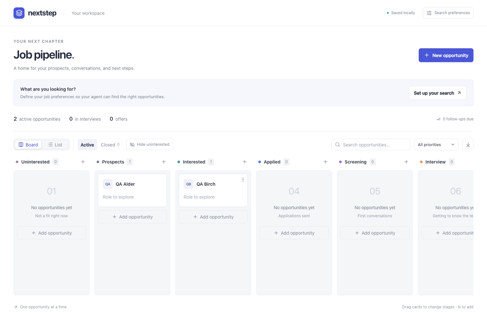

# Nextstep

A personal job-search CRM that runs on your computer. Move opportunities through a Kanban board, switch to a searchable list, and let your coding agent collect verified jobs into the same local database.

React + TypeScript, a small Node HTTP server, and SQLite. No database account, cloud service, API key, or separate database daemon is needed to use the app. Agent-assisted research uses your own agent and its browsing access.



*Example board using fictional records. New installations start empty.*

## Start in five minutes

Install **Node.js 24** and **pnpm 11.19.0**, then:

```sh
git clone https://github.com/martinrajdl/nextstep.git
cd nextstep
pnpm install --frozen-lockfile
pnpm run setup
pnpm build
pnpm background:start
```

Open **[localhost:4317](http://127.0.0.1:4317)**. The board starts empty, with no job type or search criteria selected. Setup creates `data/nextstep.sqlite`; running it again preserves your jobs and saved preferences. Choose **Search preferences** in the app, or use the setup-agent prompt below to define what you want.

```sh
pnpm background:status
pnpm background:stop
pnpm background:restart
```

The background process survives closing the terminal. It does not install a login service; start it again after logging out or restarting your computer. `pnpm start` runs in the foreground. macOS also has **Open Nextstep.command** and **Stop Nextstep.command** launchers after installation and building. The Node commands are portable; the shell and `.command` launchers are for macOS/Linux.

## Your pipeline

- **Board and list:** drag between stages, reorder cards, search, filter follow-ups, or change stages from the list/editor. Keyboard dragging uses Space, arrows, and Space to drop.
- **Stages:** Uninterested → Prospects → Interested → Applied → Screening → Interview → Final round → Offer. Hide Uninterested when you want more room; its records remain in the list.
- **Closed:** Accepted, Not moving forward, and Withdrawn. Move a record back to an active stage to reopen it.
- **Company-first prospecting:** only a company name is required when adding manually. Fill in the role, job URL, salary, contact, notes, priority, and follow-up later.
- **Local history:** activity tracking, soft deletion with Undo, JSON export, and conflict protection when two windows edit the same job.
- **Shortcuts:** `N` creates an opportunity and `/` focuses search outside editable fields.

Follow-up dates use your local calendar. The app itself does not send reminders, contact employers, or submit applications.

## Let an agent populate it

Use an agent that can read local files, run commands, and browse employer career pages, such as Codex or Claude Code. Open this repository as its working directory, then paste one of these requests:

| Task | Request to give your agent |
| --- | --- |
| Install and configure | `Follow prompts/setup.md. Ask me what jobs I want and save my answers in the app's Search preferences.` |
| Find and save jobs | `Follow prompts/collect-jobs.md using my saved Search preferences. Save verified new matches to this CRM.` |
| Import an old shortlist | `Follow prompts/import-shortlist.md to import the shortlist I provide into this CRM.` |
| Search on a schedule | Use [prompts/recurring-search.md](prompts/recurring-search.md) as the task prompt in your local agent scheduler. Choose the schedule and timezone there. |

During setup, the agent asks **what kind of job you want**, along with location/eligibility, work arrangement, employment type, compensation, experience, company preferences, and exclusions. There are no built-in roles, industries, regions, or company types. You can leave optional criteria undecided.

Your answers are saved in **Search preferences inside the app**, backed by the same private SQLite database as your board. Edit them there at any time. Agents read the current preferences through the context command before searching. If the job type is undefined, they ask you to complete setup instead of choosing one for you.

For command-line setup, use `node scripts/job-finder.mjs profile get`, then `profile set data/search-answers.json` with the current version and your answers. [The blank JSON schema](templates/profile.example.json) documents the fields. See [JOB-FINDER.md](JOB-FINDER.md#save-the-users-setup-answers) for details. Existing private Markdown profiles are preserved but should be reviewed and transferred into app preferences once.

The agent reads existing **Uninterested**, **Interested**, and **Applied** records before researching. All stages and removed records participate in duplicate checks. New matches go at the **top of Prospects**, with the best new match first. Existing stages, notes, priorities, and ordering are preserved. A company-only Uninterested card excludes the company; an uninterested specific role excludes that role.

Prompts are instructions for your agent, not a built-in crawler or autonomous AI service. Scheduled runs need a local agent with this checkout and database available; a cloud-only scheduled chat cannot write to your local SQLite file. No schedule is enabled just by cloning this repo.

See **[JOB-FINDER.md](JOB-FINDER.md)** for the full collection and import contract.

## Import from the command line

```sh
node scripts/job-finder.mjs context
node scripts/job-finder.mjs import data/research/verified-jobs.json --dry-run
node scripts/job-finder.mjs import data/research/verified-jobs.json
```

Imports accept a JSON array or `{ "opportunities": [...] }`. Each job requires `company`, `role`, and `url`. [examples/opportunities.example.json](examples/opportunities.example.json) shows the format with clearly fictional data. It is never imported automatically.

The importer checks again inside a SQLite transaction, skips duplicates and previously removed jobs, and prepends only new Prospects. Re-running the same batch is safe. Its duplicate checks cover known requisition IDs, normalized company/title pairs, and URLs without tracking parameters. The agent should additionally catch reworded titles and duplicate regional listings. This is an additive prospect importer, not a full backup restore tool.

## Data, privacy, and backups

`data/` contains your SQLite database (including Search preferences), research, and any local résumé you choose to add. It is ignored by Git, along with logs, browser test artifacts, local environment files, and database files. Keep personal additions under `data/`; check staged files before publishing your own fork.

The app serves only on `127.0.0.1`, with Host/Origin checks. It has no accounts or authentication and is intended for one person's local computer. Public source code does not make your running app or job database public. Do not expose the server to the internet.

Agent prompts ask for public employer information and keep research local. Your chosen agent provider may still process the profile and board context it reads; Nextstep does not add a model or telemetry service of its own.

The download button exports Search preferences and active/closed opportunities as JSON. For a complete backup including removed records and activity, **stop the app, then copy the `data` folder**. SQLite can have `-wal` and `-shm` companion files while running. Restore by stopping the app and replacing `data` with the complete backup. There is no full-backup import UI.

| Setting | Default | Notes |
| --- | --- | --- |
| `NEXTSTEP_DB_PATH` | `data/nextstep.sqlite` in this checkout | Shared by setup, server, and importer. Prefer an absolute path and set it consistently for every command. |
| `DB_PATH` | Unset | Legacy alias, used only when `NEXTSTEP_DB_PATH` is unset. |
| `PORT` | `4317` | Production server port. Development uses fixed UI/API ports. |
| `PLAYWRIGHT_CHANNEL` | Bundled Chromium | Set to `chrome` to test with installed Google Chrome. |

The scripts read the process environment; `.env` files are not loaded automatically. Search preferences live in the selected database, so the app and agent always share them when using the same path. Logs and background process details live in `.runtime/`.

## Development and checks

Node.js **22.13+** is required for built-in SQLite; Node 24 is recommended and used in CI.

```sh
pnpm background:stop        # if the production app is running
pnpm dev                   # Vite on 4317, API on 4318
pnpm build                 # Type-check and build
pnpm test                  # Store, import, migration, and setup tests
pnpm lint
pnpm exec playwright install chromium
pnpm test:e2e              # Isolated temporary database on port 4321
```

Development and production use the same local database unless you configure a different one. Tests create their own temporary databases and never populate your personal pipeline. CI runs the same checks on Linux. For contributors, see [CONTRIBUTING.md](CONTRIBUTING.md); coding agents should read [AGENTS.md](AGENTS.md).

The UI optionally exposes `list_opportunities`, `create_opportunity`, and `move_opportunity` through WebMCP in supporting browsers. The app and file-based importer work without it.

## License

[MIT](LICENSE). Built with React, Vite, SQLite, dnd-kit, and shadcn/ui components. See [third-party notices](THIRD_PARTY_NOTICES.md).
